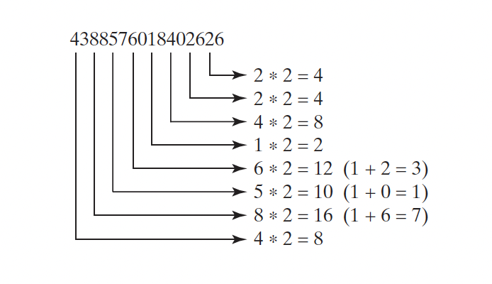

(Financial: credit card number validation) Credit card numbers follow certain
patterns: It must have between 13 and 16 digits, and the number must start with:

- 4 for Visa cards
- 5 for MasterCard credit cards
- 37 for American Express cards
- 6 for Discover cards

In 1954, Hans Luhn of IBM proposed an algorithm for validating credit card numbers.
The algorithm is useful to determine whether a card number is entered correctly
or whether a credit card is scanned correctly by a scanner. Credit card
numbers are generated following this validity check, commonly known as the
Luhn check or the Mod 10 check, which can be described as follows (for illustration,
consider the card number 4388576018402626):

1. Double every second digit from right to left. If doubling of a digit results in a
   two-digit number, add up the two digits to get a single-digit number.

